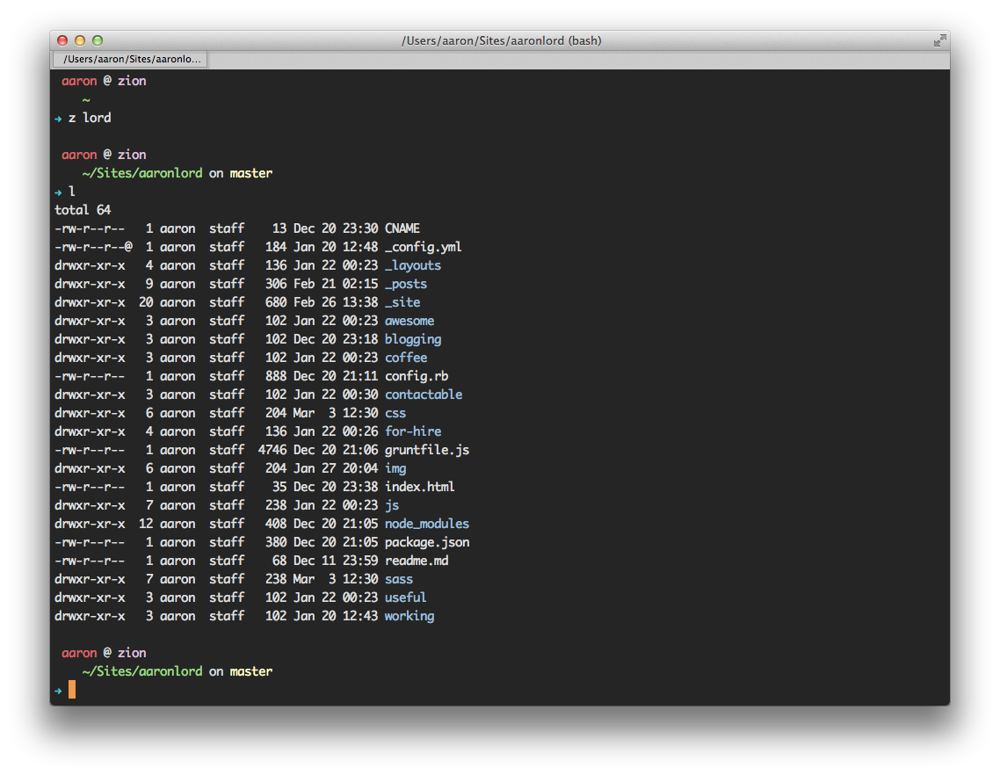

> As an engineer, there is a short list of tools that you must be rabid about. Rabid. Foaming at the mouth crazy.
>
> -- <cite>[Michael Lopp][1]</cite>

### Installation

```
$ cd ~
$ git clone https://github.com/aaronlord/.dotfiles.git
$ ln -s ~/.dotfiles/.bash_profile ~/.bash_profile
$ source ~/.bash_profile
```

### Screenshot



[1]:http://www.randsinrepose.com/archives/2009/11/02/the_foamy_rules_for_rabid_tools.html
