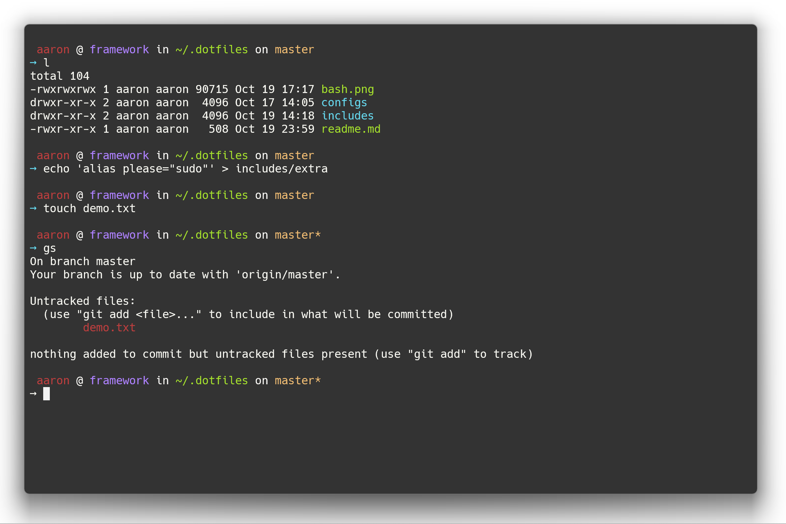

> As an engineer, there is a short list of tools that you must be rabid about. Rabid. Foaming at the mouth crazy.
>
> -- <cite>[Michael Lopp][1]</cite>

### Installation

Usually, your existing .bashrc will automatically include a .bash_aliases:

```
/bin/bash -c "$(curl -fsSL https://raw.githubusercontent.com/aaronlord/.dotfiles/HEAD/install.sh)"
```

### Screenshot



[1]:http://www.randsinrepose.com/archives/2009/11/02/the_foamy_rules_for_rabid_tools.html
